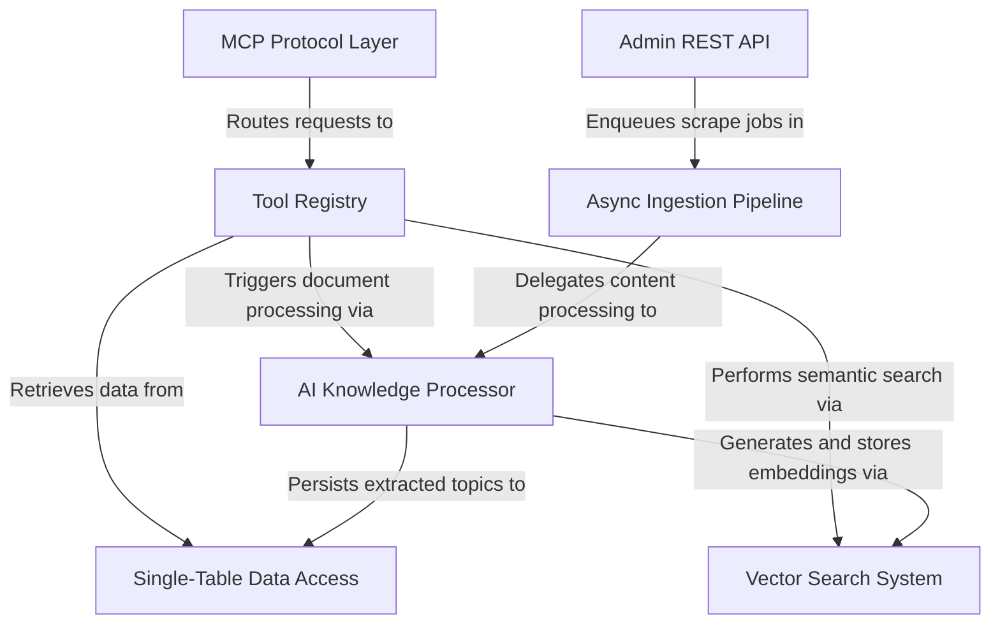

# memory-mcp

An MCP server that functions as an intelligent knowledge base for AI agents. It automates the ingestion of documentation (from sources like Jira and Confluence), uses AI to distill raw text into structured "How-To" guides, and enables agents to query this memory using vector search.



## Architecture

| Layer | Purpose |
|:---|:---|
| **MCP Protocol Layer** | JSON-RPC 2.0 front door for AI agents — validates, parses, and routes requests |
| **Tool Registry** | Central catalog of capabilities exposed to agents (`add_doc`, `semantic_search`, `list_topics`, etc.) |
| **AI Knowledge Processor** | Extracts structured How-To guides from raw documents using an LLM, with deduplication |
| **Vector Search System** | Generates embeddings (Amazon Titan) and performs cosine-similarity search over S3-stored vectors |
| **Single-Table Data Access** | DynamoDB single-table design (PK/SK + GSI) for projects, documents, and topics |
| **Async Ingestion Pipeline** | SQS-backed scrape and process workers for background bulk imports from Jira/Confluence |
| **Admin REST API** | REST endpoints for human-facing dashboards — manage projects, trigger scrapes, retry jobs, control concurrency |

## MCP Tools

| Tool | Description |
|:---|:---|
| `add_doc` | Ingest a document — AI extracts How-To guides, deduplicates, and stores |
| `get_document` | Retrieve a document by ID |
| `semantic_search` | Vector similarity search across the knowledge base |
| `list_projects` | List all projects |
| `create_project` | Create a new project |
| `list_topics` | List topics in a project |
| `list_categories` | List topic categories |
| `list_documents` | List documents in a project |
| `rebuild_site` | Trigger a Hugo site rebuild via ECS Fargate |

## WebTools Extensions

This implementation extends the standard MCP protocol with:

- **`configSchema`** on `tools/list` — lets the server declare config params (tokens, creds) that clients send separately from the LLM payload
- **`config`** on `tools/call` — passes user-provided config without exposing it to the LLM
- **`version`** on both — pin a specific tool schema version to avoid schema-injection attacks
- **`extra`** on `tools/call` response — return charts, raw data, or logs that skip the LLM and go straight to the environment

## Project Structure

```
memory-mcp/
├── template.yaml              # AWS SAM template
├── src/
│   ├── index.js               # MCP Lambda handler (JSON-RPC)
│   ├── mcp/
│   │   ├── router.js          # JSON-RPC method router
│   │   ├── handlers/          # initialize, ping, tools, prompts, resources
│   │   └── utils.js           # JSON-RPC response helpers
│   ├── tools/                 # MCP tool definitions + execute functions
│   ├── lib/
│   │   ├── ai.js              # LLM extraction & classification (Bedrock Claude)
│   │   ├── embeddings.js      # Embedding generation & vector search (Titan)
│   │   ├── processor.js       # Document processing orchestrator
│   │   ├── db.js              # DynamoDB single-table access
│   │   ├── queue.js           # SQS job tracking helpers
│   │   ├── scraper.js         # Jira/Confluence scrapers (async generators)
│   │   └── html.js            # HTML parsing utilities
│   ├── admin/
│   │   ├── index.js           # Admin API Lambda handler
│   │   ├── router.js          # REST path router
│   │   └── routes/            # projects, documents, categories, search, queues, scrape, site
│   ├── workers/
│   │   ├── scrapeWorker.js    # SQS-triggered bulk scraper
│   │   └── processWorker.js   # SQS-triggered AI processor
│   └── package.json
├── site/                      # Hugo site builder (Dockerfile for ECS Fargate)
└── intro/                     # Tutorial documentation
```

## AWS Resources

Deployed via SAM (`template.yaml`):

- **Lambda functions** — MCP server, Admin API, scrape worker, process worker (Node.js 22 / ARM64)
- **DynamoDB** — single table with GSI1, PAY_PER_REQUEST
- **S3** — vector storage bucket + Hugo site bucket
- **SQS** — scrape queue + process queue (with DLQs)
- **CloudFront** — CDN for the generated Hugo site
- **ECS Fargate** — Hugo site builder (FARGATE_SPOT)
- **ECR** — container registry for the Hugo builder image

## Deployment

### Prerequisites

1. [AWS SAM CLI](https://docs.aws.amazon.com/serverless-application-model/latest/developerguide/install-sam-cli.html)
2. Node.js 22
3. AWS credentials configured
4. A VPC with public subnets (for Fargate tasks)

### Build and Deploy

```bash
sam build
sam deploy --region us-east-1 --parameter-overrides VpcId=vpc-xxx SubnetIds=subnet-aaa,subnet-bbb
```

After deployment, SAM outputs the MCP server URL and Admin API URL.

### Testing

```bash
curl -X POST https://<mcp-server-url> \
  -H "Content-Type: application/json" \
  -d '{"jsonrpc":"2.0","id":1,"method":"tools/list"}'
```

## Documentation

See the [intro/](intro/) directory for a full tutorial covering each architectural layer.
