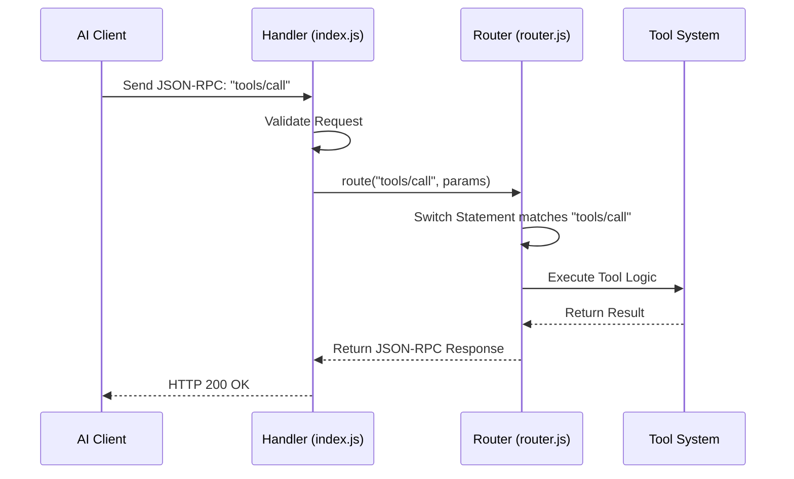

# Chapter 1: MCP Protocol Layer

Welcome to the `memory-mcp` project! In this first chapter, we are going to build the "front door" of our application.

## The Problem: How do AIs talk to code?

Imagine you are building a smart assistant. You want an AI (like Claude) to be able to save information to a database.
*   **The AI** knows it wants to "save a note."
*   **Your Code** has a function called `saveNote(text)`.

But the AI can't just reach into your server and run that function. They speak different languages and live in different places. We need a standard way for them to communicate.

**The Solution:** The **MCP Protocol Layer**.

Think of this layer as a **Universal Translator** and **Traffic Controller**.
1.  **Receive:** It catches messages sent by the AI.
2.  **Validate:** It checks if the message follows the rules (JSON-RPC).
3.  **Route:** It looks at the message label (e.g., "call a tool") and sends it to the right department.

### The Use Case

Throughout this chapter, we will solve this specific scenario:
> An AI sends a request saying: *"I want to use the tool named 'add_memory' to save 'User likes apples'."*
> Our server needs to understand this request and trigger the correct code.

---

## Concept 1: The Envelope (JSON-RPC)

Before we look at code, we need to understand the "envelope" used for messages. We use a standard called **JSON-RPC 2.0**.

It looks like this:

```json
{
  "jsonrpc": "2.0",
  "id": 1,
  "method": "tools/call",
  "params": {
    "name": "add_memory",
    "arguments": { "content": "User likes apples" }
  }
}
```

*   **jsonrpc**: The version stamp (always "2.0").
*   **id**: A ticket number (so the AI knows which answer belongs to which question).
*   **method**: What the AI wants to do.
*   **params**: The details of the request.

---

## Handling the Request

Let's look at how our server processes this envelope. We will look at `src/index.js`, which is the entry point (the receptionist) of our server.

### Step 1: Receiving the Message

First, we need to grab the message body from the incoming web request.

```javascript
// Inside src/index.js
export const handler = async (event) => {
  // 1. Get the message body (or empty object if missing)
  const body = event.body || '{}';
  
  // 2. Parse the text into a JavaScript object
  let request;
  try {
    request = JSON.parse(body);
  } catch (error) {
    return { statusCode: 400, body: 'Parse error' };
  }
  // ... continue ...
```
*Explanation:* We take the raw text sent to our server and turn it into a usable code object. If the JSON is broken, we stop right there.

### Step 2: Validating the Envelope

We shouldn't try to process a letter if it doesn't have an address. We use a helper function to check standard rules.

```javascript
// Inside src/index.js
import { validateRequest, createErrorResponse } from './mcp/utils.js';

// ... inside handler ...
const validation = validateRequest(request);

if (!validation.valid) {
  // If invalid, send an error back immediately
  return {
    statusCode: 400,
    body: JSON.stringify(createErrorResponse(null, -32600, validation.error))
  };
}
```
*Explanation:* We check: Is this JSON-RPC 2.0? Does it have a method? If not, we return a "400 Bad Request" error.

### Step 3: The Traffic Controller (Routing)

Now that we know the message is valid, we pass it to the **Router**. The router decides which internal system handles the job.

```javascript
// Inside src/index.js
import { route } from './mcp/router.js';

// ... inside handler ...
// Pass the method and params to the router
const response = await route(request.method, request.params, request.id);

// Return the result back to the AI
return {
  statusCode: 200,
  headers: { 'Content-Type': 'application/json' },
  body: JSON.stringify(response)
};
```
*Explanation:* We hand off the hard work to `route()`. Whatever it returns, we wrap it up and send it back to the AI with a "200 OK" status.

---

## Under the Hood: The Routing Logic

What happens inside that `route()` function? Let's visualize the flow.



### The Router Code

Let's peek into `src/mcp/router.js`. This file is a big switchboard.

```javascript
// src/mcp/router.js
import * as toolsHandler from './handlers/tools.js';
// ... other imports ...

export async function route(method, params, id) {
  switch (method) {
    case 'initialize':
      return await initializeHandler.handle(params, id);
      
    case 'tools/list':
      return await toolsHandler.handleList(params, id);
      
    case 'tools/call':
      // The AI wants to RUN a tool
      return await toolsHandler.handleCall(params, id);

    default:
      return createErrorResponse(id, -32601, `Method not found: ${method}`);
  }
}
```
*Explanation:*
1.  The function looks at the `method` string.
2.  If it sees `tools/call`, it imports the specific logic for handling tools.
3.  If it sees a method it doesn't know, it returns a "Method not found" error.

### Why separate the Router?

You might wonder, why not put all the logic in `index.js`?
By separating the **Router**, our main file stays clean. The `index.js` only worries about HTTP and JSON. The `router.js` worries about *where* to send data.

This prepares us for the next chapters. For example, when the router sees `tools/call`, it delegates to the **Tool Registry**. When it sees `resources/read`, it delegates to the **AI Knowledge Processor**.

---

## Helper Utilities

Finally, let's look at `src/mcp/utils.js`. This is our toolbox for creating standard messages.

**Creating a Success Response:**
```javascript
// src/mcp/utils.js
export function createResponse(id, result) {
  return {
    jsonrpc: '2.0',
    id,
    result // The actual data we want to send back
  };
}
```

**Creating an Error Response:**
```javascript
// src/mcp/utils.js
export function createErrorResponse(id, code, message) {
  return {
    jsonrpc: '2.0',
    id,
    error: { code, message }
  };
}
```

*Explanation:* These tiny functions ensure we never accidentally send a malformed message. Consistency is key when talking to AIs!

---

## Summary

In this chapter, we built the communication backbone of our server:

1.  **The Handler (`index.js`)**: Accepts HTTP requests and parses JSON.
2.  **The Validator**: Ensures the AI speaks the correct protocol (JSON-RPC).
3.  **The Router (`router.js`)**: Directs traffic based on the `method` (like `tools/call`).

Currently, if our router sends a request to `toolsHandler`, there isn't much there yet. We have the traffic controller, but we haven't built the destination!

In the next chapter, we will build the actual "Tools" department that this layer routes to.

[Next Chapter: Tool Registry](02_tool_registry_.md)

---

Generated by [AI Codebase Knowledge Builder](https://github.com/The-Pocket/Tutorial-Codebase-Knowledge)