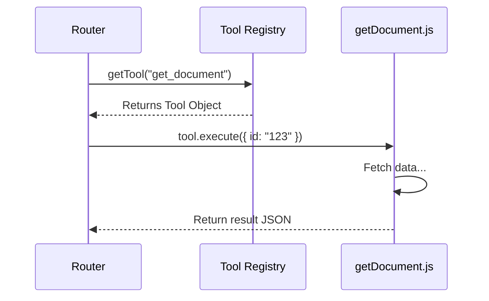

# Chapter 2: Tool Registry

In the previous chapter, [MCP Protocol Layer](01_mcp_protocol_layer_.md), we built the "front door" of our server. We created a Router that can receive a message like "Call the tool named `get_document`."

However, right now, our server is like a restaurant with a waiter (the Router) but no kitchen and no menu. If the AI asks for "get_document," the Router doesn't know where to find that code.

In this chapter, we will build the **Tool Registry**.

## The Problem: What can the AI do?

An AI (like Claude or GPT) is very smart, but it doesn't know your code. It doesn't know you have a function called `findFileById` or `searchDatabase`.

To fix this, we need two things:
1.  **A Menu (Definitions):** A list describing exactly what tools are available and what inputs they need.
2.  **The Kitchen (Execution):** The actual code that runs when a tool is selected.

**The Solution:** The **Tool Registry**. It connects the generic request from the AI to specific business logic in our application.

### The Use Case

We will solve this specific scenario:
> The AI wants to read a document with the ID `123`.
> It sends a request: `tools/call` with name `get_document` and arguments `{ id: "123" }`.
> Our Registry must find the right code and run it.

---

## Concept 1: Anatomy of a Tool

A "Tool" in MCP isn't just a function. It's an object that contains both the **Description** (for the AI) and the **Code** (for the server).

Let's look at `src/tools/getDocument.js`. We'll break it into two parts.

### Part A: The Description (The Menu Item)

This part tells the AI *how* to use the tool. We use **JSON Schema** to define the inputs.

```javascript
// src/tools/getDocument.js
export const getDocument = {
  name: 'get_document',
  description: 'Retrieve a document by its ID',
  inputSchema: {
    type: 'object',
    properties: {
      id: { type: 'string', description: 'The ID of the document' },
    },
    required: ['id'],
  },
  // ... code continues ...
```

*   **name**: The unique ID the AI uses to call this.
*   **description**: A hint to the AI about when to use this tool.
*   **inputSchema**: Strict rules. Here, we say: "You MUST provide an `id` and it MUST be a string."

### Part B: The Execution (The Recipe)

This is the function that actually runs. It takes the arguments provided by the AI.

```javascript
// src/tools/getDocument.js (continued)
  async execute(args, config) {
    const { id } = args;
    // We will simulate getting data for now
    const doc = { id, title: "My Note", contents: "Hello World" };

    return {
      content: [{
        type: 'text',
        text: JSON.stringify(doc, null, 2),
      }],
      isError: false,
    };
  },
};
```

*   **args**: The data from the AI (e.g., `{ id: "123" }`).
*   **config**: Server settings (like database keys).
*   **return**: We return a text string (JSON) so the AI can read it.

---

## Concept 2: The Registry (The Menu)

Now that we have one tool, we might have many others (like `list_topics` or `rebuild_site`). We need a central place to list them all.

This is handled in `src/tools/index.js`.

```javascript
// src/tools/index.js
import { getDocument } from './getDocument.js';
import { listTopics } from './listTopics.js';
// ... import other tools ...

// 1. The Master List
export const tools = [
  getDocument,
  listTopics,
];
```

We also need a helper function to find a specific tool when the Router asks for it.

```javascript
// src/tools/index.js (continued)

// 2. The Lookup Function
export function getTool(name) {
  // Search the array for a tool with the matching name
  return tools.find(tool => tool.name === name);
}
```

*Explanation:* This file acts as the central index. If you create a new tool, you must add it to this array, or the AI won't know it exists.

---

## Under the Hood: The Execution Flow

How does the **Router** (from Chapter 1) interact with this **Registry**?

When a request comes in, the Router asks the Registry: "Do you have a tool named 'get_document'?" If yes, it runs it.



### Implementing the Handler

In the previous chapter, we mentioned a file `src/mcp/handlers/tools.js`. Now we can see how it uses the Registry.

**Handling `tools/list`:**
The AI often asks "What tools do you have?" first.

```javascript
// src/mcp/handlers/tools.js
import { tools } from '../../tools/index.js';

export async function handleList(params, id) {
  return {
    tools: tools.map(t => ({
      name: t.name,
      description: t.description,
      inputSchema: t.inputSchema
    }))
  };
}
```
*Explanation:* We map over our list and send back the definitions. This is like handing the menu to the customer.

**Handling `tools/call`:**
This is when the AI actually orders something.

```javascript
// src/mcp/handlers/tools.js
import { getTool } from '../../tools/index.js';

export async function handleCall(params, id) {
  const tool = getTool(params.name);

  if (!tool) {
    throw new Error(`Tool not found: ${params.name}`);
  }

  // Run the tool!
  return await tool.execute(params.arguments, { /* config */ });
}
```
*Explanation:*
1.  We look up the tool by name.
2.  If it doesn't exist, we crash (gracefully).
3.  If it exists, we run `.execute()`.

---

## Example: A "List Topics" Tool

Let's look at one more example to see the pattern repeated. This tool lists categories.

```javascript
// src/tools/listTopics.js
export const listTopics = {
  name: 'list_topics',
  description: 'List all topics in a category',
  inputSchema: {
    type: 'object',
    properties: {
      category: { type: 'string' },
    },
    required: ['category'],
  },
  
  async execute(args) {
    // Logic to find topics...
    const result = ["Coding", "Cooking"]; 
    
    return {
      content: [{ type: 'text', text: JSON.stringify(result) }],
      isError: false,
    };
  },
};
```

You can see the pattern is identical:
1.  Define the schema.
2.  Define the `execute` function.
3.  Add it to the registry array in `index.js`.

---

## Summary

In this chapter, we created the "Menu" of capabilities for our AI agent.

1.  **Tool Definition:** We wrapped our code in an object with a `name`, `description`, and `inputSchema`.
2.  **Tool Registry:** We created a central list (`tools/index.js`) to manage all available tools.
3.  **Execution:** We wired up the Router to find a tool and run its `execute` function.

**But wait...**
In our examples, we faked the data:
`const doc = { id, title: "My Note" };`

In a real application, we need to fetch this from a database or a smart storage system. We need a brain to manage this information.

In the next chapter, we will build the system that actually retrieves this data.

[Next Chapter: AI Knowledge Processor](03_ai_knowledge_processor_.md)

---

Generated by [AI Codebase Knowledge Builder](https://github.com/The-Pocket/Tutorial-Codebase-Knowledge)