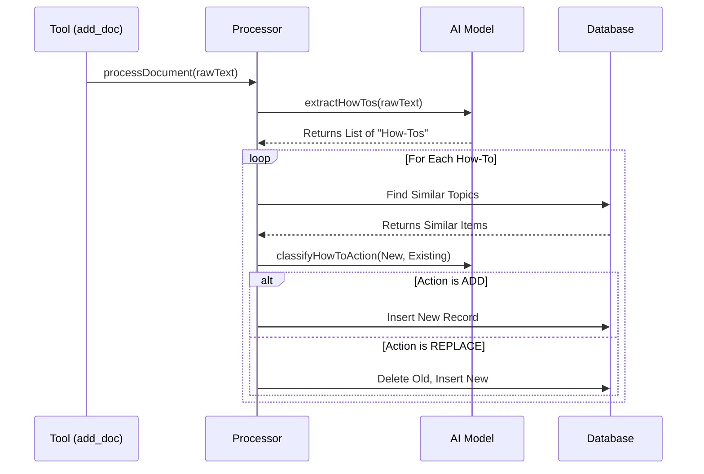

# Chapter 3: AI Knowledge Processor

In the previous chapter, [Tool Registry](02_tool_registry_.md), we built the menu of actions our server can perform. We defined a tool called `add_doc`, but right now, it doesn't actually *do* anything smart. It just sits there waiting for logic.

In this chapter, we will build the "Brain" of our application: the **AI Knowledge Processor**.

## The Problem: Raw Data is Messy

Imagine you are building a knowledge base for a company. A user uploads a 50-page PDF titled "Server Maintenance Protocols."
*   **The Reality:** The document contains legal disclaimers, table of contents, jokes, and three actual paragraphs about how to restart the server.
*   **The Risk:** If we just save the whole text, our database becomes a digital junk drawer. Searching for "restart server" might return page 42 (the index) instead of page 10 (the instructions).

**The Solution:** The **AI Knowledge Processor**.

Think of this processor as a **Smart Editor**. It reads every document you upload, throws away the junk, extracts the specific "How-To" guides, and organizes them neatly.

### The Use Case

We will solve this specific scenario:
> A user sends a raw text file.
> 1. The Processor reads it and finds a specific guide: "How to restart the Khoros server."
> 2. It checks the database: "Do we already have a guide for this?"
> 3. If yes, it updates the old one. If no, it files a new one.

---

## Concept 1: The Extractor (Reading)

The first job of our processor is to turn unstructured text (paragraphs) into structured data (JSON). We use a Large Language Model (like Claude) to do this.

We don't just ask for a summary. We ask for a list of **How-Tos**.

### The Schema

We use a library called `zod` to force the AI to answer in a specific format.

```javascript
// src/lib/ai.js (Simplified)
import { generateText, Output } from 'ai';
import { z } from 'zod';

// We define exactly what we want the AI to return
const schema = z.object({
  howtos: z.array(z.object({
    category: z.string(), // e.g., "server/maintenance"
    title: z.string(),    // e.g., "How to restart the server"
    steps: z.string(),    // The actual instructions
    notes: z.string()     // Warnings or prerequisites
  }))
});
```
*Explanation:* This acts like a form. We tell the AI: "Fill out this form based on the text I give you."

### The Extraction Function

Now we send the text to the AI model.

```javascript
// src/lib/ai.js
export async function extractHowTos(contents, url) {
  const { output } = await generateText({
    model: MODEL, // e.g., Bedrock Claude
    output: Output.object({ schema }), // Use the schema from above
    prompt: `Extract actionable how-to procedures from this document:
             ${contents}`
  });

  return output; // Returns clean JSON!
}
```
*Explanation:*
1.  We pass the raw `contents`.
2.  The AI reads it.
3.  The AI returns a clean JavaScript object containing only the useful instructions.

---

## Concept 2: The Judge (Deduplication)

Here is where our system gets smart. We don't want five different versions of "How to restart the server."

Before saving a new "How-To," we ask the AI to compare it with existing records.

```javascript
// src/lib/ai.js
export async function classifyHowToAction(newBody, newTitle, similarItems) {
  // If the database is empty, just add it.
  if (similarItems.length === 0) return { action: 'ADD' };

  // Ask AI to compare
  const { output } = await generateText({
    model: MODEL,
    prompt: `Compare this new guide: "${newTitle}"
             With these existing guides: ${JSON.stringify(similarItems)}
             
             Should I ADD this as a new topic, or REPLACE the existing one?`
  });

  return output; // Returns { action: "ADD" } or { action: "REPLACE", replaceIds: [...] }
}
```
*Explanation:*
*   **ADD:** The AI decides this is a brand new topic.
*   **REPLACE:** The AI sees that we already have this guide, but the new one might be better or updated. It tells us to overwrite the old one.

---

## Under the Hood: The Processing Pipeline

Now, let's put it all together in `src/lib/processor.js`. This is the file that orchestrates the flow.

### The Flow



### The Code Implementation

We'll look at the main function `processDocument`.

**Step 1: Check for Duplicates (Optimization)**
We don't want to pay for AI processing if the file hasn't changed.

```javascript
// src/lib/processor.js
export async function processDocument(projectId, { url, contents }) {
  // Create a fingerprint of the text
  const contentsSha256 = sha256(contents);

  // Check if we processed this exact file recently
  const existing = await getLatestDocByUrl(projectId, url);
  
  if (existing && existing.contentsSha256 === contentsSha256) {
    return { skipped: true, reason: 'Content unchanged' };
  }
  // ... continue ...
```

**Step 2: Extract and Loop**
If it is new, we run the extraction.

```javascript
// src/lib/processor.js (continued)
  // 1. Save the raw doc for backup
  await putDoc(projectId, { url, contents });

  // 2. AI extracts the structured guides
  const { howtos } = await extractHowTos(contents, url);

  // 3. Process each guide individually
  const results = [];
  for (const item of howtos) {
    // This helper function handles the "Judge" logic
    const result = await processEntry(projectId, item);
    results.push(result);
  }

  return { howTosProcessed: results.length };
}
```

**Step 3: The Entry Processor (The Judge's Execution)**
This helper function `processEntry` handles the logic of saving vs. updating.

```javascript
// src/lib/processor.js (simplified processEntry)
async function processEntry(projectId, item) {
  // 1. Create a math fingerprint (embedding) for search
  const embedding = await generateEmbedding(item.title + item.body);
  
  // 2. Find similar existing items
  const similar = await findSimilarByEmbedding(projectId, embedding);
  
  // 3. Ask AI: Add or Replace?
  const decision = await classifyHowToAction(item.body, item.title, similar);

  if (decision.action === 'REPLACE') {
    // Delete old ones, save new one
    await replaceTopic(projectId, decision.replaceIds, item);
  } else {
    // Save as new
    await putTopic(projectId, item);
  }
}
```
*Note:* We mentioned `generateEmbedding` here. This converts text into numbers so computers can compare meanings. We will explain this fully in the next chapter.

---

## Connecting to the Tool Registry

Finally, remember the `add_doc` tool we looked at in Chapter 2? Now we can fill in the blank.

```javascript
// src/tools/addDoc.js
import { processDocument } from '../lib/processor.js';

export const addDoc = {
  name: 'add_doc',
  // ... schema ...
  async execute(args, config) {
    // We simply hand the work to our new Processor!
    const result = await processDocument(
      config.projectId, 
      { url: args.url, contents: args.contents }
    );

    return { content: [{ type: 'text', text: JSON.stringify(result) }] };
  },
};
```

---

## Summary

In this chapter, we built the intelligence of our system.
1.  **Extraction:** We used `extractHowTos` to turn messy documents into clean, structured steps.
2.  **Deduplication:** We used `classifyHowToAction` to ensure we don't store duplicate information, keeping our knowledge base clean.
3.  **Orchestration:** We wired it all together in `processDocument`.

However, we glossed over one magic trick: **"Find Similar Topics."**
How does the computer know that "Restart Server" is similar to "Reboot System"? They use different words!

To solve this, we need **Vector Embeddings**.

[Next Chapter: Vector Search System](04_vector_search_system_.md)

---

Generated by [AI Codebase Knowledge Builder](https://github.com/The-Pocket/Tutorial-Codebase-Knowledge)