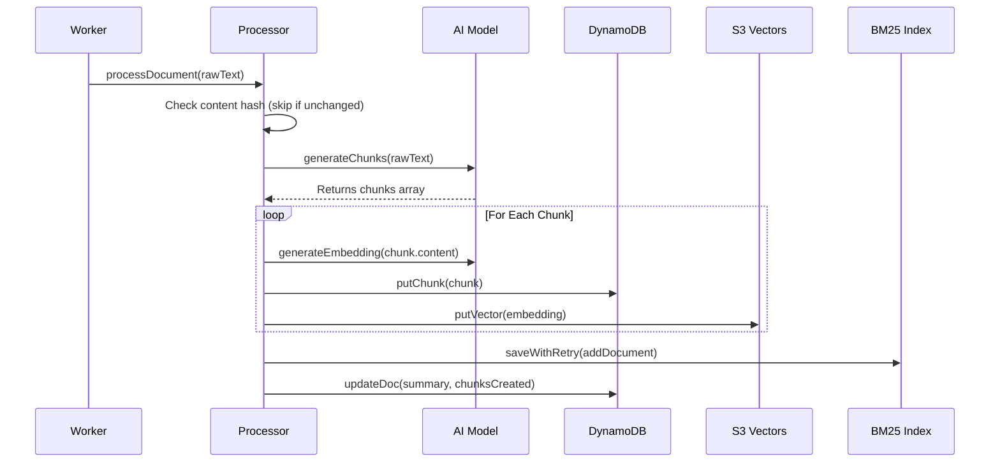

# Chapter 3: AI Knowledge Processor

In the previous chapter, [Tool Registry](02_tool_registry_.md), we built the menu of actions our server can perform. Now we need the logic that actually processes documents into searchable knowledge.

In this chapter, we will build the "Brain" of our application: the **AI Knowledge Processor**.

## The Problem: Raw Data is Messy

Imagine you are building a knowledge base for a company. A user uploads a 50-page document titled "Server Maintenance Protocols."
*   **The Reality:** The document contains legal disclaimers, table of contents, and three actual paragraphs about how to restart the server.
*   **The Risk:** If we just save the whole text, searching for "restart server" might return irrelevant sections.

**The Solution:** The **AI Knowledge Processor**.

Think of this processor as a **Smart Editor**. It reads every document, breaks it into meaningful **chunks** (summaries, Q&A pairs, key text sections), generates vector embeddings for each chunk, and updates the BM25 keyword index.

### The Use Case

We will solve this specific scenario:
> A user sends a raw document.
> 1. The Processor breaks it into structured chunks (summary, Q&A, text).
> 2. Each chunk gets a vector embedding for semantic search.
> 3. The full document text is added to the BM25 keyword index.
> 4. If the document URL already exists, old chunks are replaced.

---

## Concept 1: The Chunker (Breaking Documents Apart)

The first job of our processor is to turn unstructured text into structured **chunks**. We use a Large Language Model (Claude Haiku via Bedrock) to do this.

Each document is broken into chunks of different types:
*   **summary** — A concise overview of the document.
*   **qa** — Question-and-answer pairs extracted from the content.
*   **text** — Key factual sections preserved verbatim.

### The Schema

We use `zod` to force the AI to return chunks in a specific format.

```javascript
// src/lib/ai.js (Simplified)
import { generateText, Output } from 'ai';
import { z } from 'zod';

const schema = z.object({
  chunks: z.array(z.object({
    type: z.enum(['summary', 'qa', 'text']),
    content: z.string(),
  }))
});
```

### The Chunking Function

```javascript
// src/lib/ai.js
export async function generateChunks(contents, url, chunkingPrompt) {
  const { output } = await generateText({
    model: MODEL, // Bedrock Claude Haiku
    output: Output.object({ schema }),
    prompt: `Break this document into structured chunks:\n${contents}`
  });

  return output; // Returns { chunks: [{ type, content }, ...] }
}
```
*Explanation:* The AI reads the raw document and returns an array of typed chunks, each with focused, searchable content.

---

## Concept 2: Deduplication by URL

Documents are unique by URL within a project. If a document with the same URL is processed again:
1.  The content SHA-256 hash is compared. If unchanged, processing is skipped.
2.  If changed, old chunks and their vector embeddings are deleted, and new ones are created.

```javascript
// src/lib/processor.js (simplified)
const existing = await getLatestDocByUrl(projectId, url);

if (!force && existing && existing.contentsSha256 === contentsSha256) {
  return { skipped: true, reason: 'Content unchanged' };
}

// If document exists, clean up old chunks before creating new ones
if (existing) {
  await deleteVectorsByDoc(projectId, oldChunkIds);
  await deleteChunksByDoc(projectId, docId);
}
```

---

## Under the Hood: The Processing Pipeline

Now, let's put it all together in `src/lib/processor.js`. This is the file that orchestrates the flow.

### The Flow



### The Code Implementation

The main function `processDocument` handles the full pipeline:

```javascript
// src/lib/processor.js (simplified)
export async function processDocument(projectId, { url, contents, title }) {
  // 1. Skip if content unchanged
  const contentsSha256 = sha256(contents);
  const existing = await getLatestDocByUrl(projectId, url);
  if (existing?.contentsSha256 === contentsSha256) {
    return { skipped: true };
  }

  // 2. AI breaks document into structured chunks
  const { chunks } = await generateChunks(contents, url, chunkingPrompt);

  // 3. For each chunk: embed, store in DynamoDB, store vector
  for (const chunk of chunks) {
    const embedding = await generateEmbedding(chunk.content);
    await putChunk(projectId, { type: chunk.type, content: chunk.content, docId });
    await putVector(projectId, chunkId, { embedding, type: chunk.type, docId });
  }

  // 4. Update the BM25 keyword index (with optimistic locking)
  await saveWithRetry(projectId, (index) => {
    bm25AddDocument(index, docId, contents);
  });

  return { chunksCreated: chunks.length };
}
```

The BM25 index update uses **optimistic locking** via S3 ETags to handle concurrent writes from multiple workers safely.

---

## Connecting to the Pipeline

The processor is called from two places:
1.  **The Process Worker** (`src/workers/processWorker.js`) — for background batch processing of scraped documents.
2.  **The Admin API** (`POST /projects/:id/documents`) — for single document ingestion via the UI.

---

## Summary

In this chapter, we built the intelligence of our system.
1.  **Chunking:** We used `generateChunks` to break messy documents into structured, typed chunks (summary, Q&A, text).
2.  **Deduplication:** We skip unchanged documents by comparing content hashes, and replace old chunks when a document is updated.
3.  **Dual Indexing:** Each chunk gets a vector embedding for semantic search, and the full document text is added to the BM25 keyword index.
4.  **Orchestration:** We wired it all together in `processDocument`.

However, we glossed over one magic trick: **vector embeddings and similarity search.**
How does the computer know that "Restart Server" is similar to "Reboot System"? They use different words!

To solve this, we need the **Vector Search System**.

[Next Chapter: Vector Search System](04_vector_search_system_.md)

---

Generated by [AI Codebase Knowledge Builder](https://github.com/The-Pocket/Tutorial-Codebase-Knowledge)