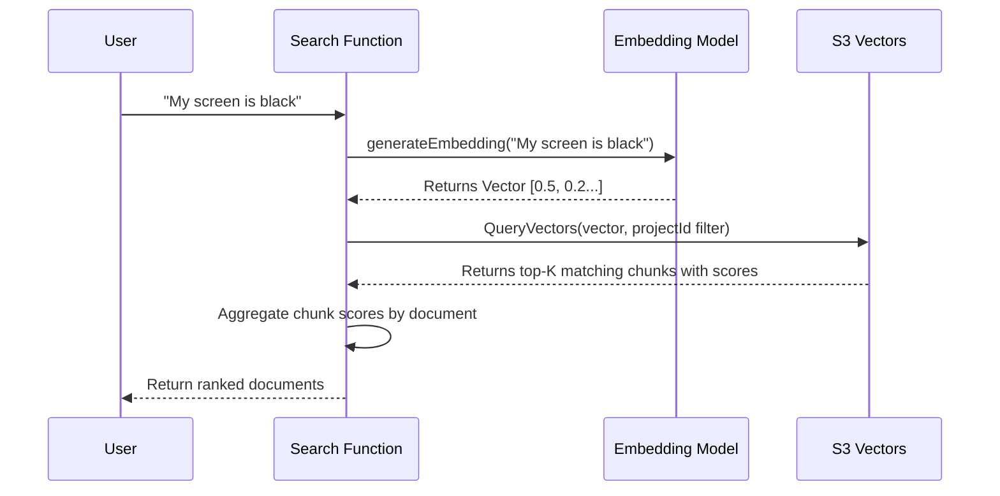

# Chapter 4: Vector Search System

In the previous chapter, [AI Knowledge Processor](03_ai_knowledge_processor_.md), we built a "Brain" that extracts useful "How-To" guides from messy documents. We mentioned a magic step where the processor checks if a topic already exists to avoid duplicates.

But how does the computer know that *"How to fix login"* is the same topic as *"Troubleshooting authentication"*? They don't share a single word!

In this chapter, we will build the **Vector Search System**.

## The Problem: Keywords are Dumb

Traditional search engines look for exact word matches.
*   **Query:** "Big red apple"
*   **Document:** "Large crimson fruit"
*   **Result:** No match. (Because "Big" != "Large").

This is bad for a smart assistant. Users speak naturally; they don't use specific database keywords.

**The Solution:** **Vector Embeddings**.

We need a system that translates **Text** into **Numbers** (coordinates) based on *meaning*.
*   "Big" and "Large" will have similar numbers.
*   "Apple" and "Car" will have very different numbers.

### The Use Case

We will solve this specific scenario:
> 1. We have a database of technical guides.
> 2. A user asks: "My screen is black."
> 3. Our system finds the guide titled "Display troubleshooting" because the *meaning* is close.

---

## Concept 1: Embeddings (The Translator)

An **Embedding** is just a list of numbers (a vector). You can think of it like coordinates on a map.

Imagine a map of "Concepts":
*   "Cat" and "Dog" are close together in the "Animal" city.
*   "Car" and "Truck" are close together in the "Vehicle" city.
*   "Cat" is very far away from "Truck".

We use an AI model (specifically an **Embedding Model**) to turn text into these coordinates.

```javascript
// src/lib/embeddings.js (Simplified)
import { embed } from 'ai';
import { bedrock } from '@ai-sdk/amazon-bedrock';

const EMBED_MODEL = bedrock.textEmbeddingModel('amazon.titan-embed-text-v2:0');

export async function generateEmbedding(text) {
  // Ask the AI model to convert text to numbers
  const { embedding } = await embed({
    model: EMBED_MODEL,
    value: text,
  });

  return embedding; // Returns [0.12, -0.54, 0.88, ...]
}
```
*Explanation:* We give the model text. It gives us back an array of floating-point numbers representing the "location" of that meaning.

---

## Concept 2: The Bookshelf (S3 Vectors)

Once we turn a chunk into a list of numbers, we need to save it. We use **AWS S3 Vectors**, a managed vector storage service that handles indexing and similarity queries natively.

```javascript
// src/lib/embeddings.js
import { S3VectorsClient, PutVectorsCommand } from '@aws-sdk/client-s3vectors';
const s3v = new S3VectorsClient({});

export async function putVector(projectId, chunkId, data) {
  await s3v.send(new PutVectorsCommand({
    indexArn: process.env.VECTOR_INDEX,
    vectors: [{
      key: `${projectId}#${chunkId}`,
      data: { float32: data.embedding },
      metadata: { projectId, docId: data.docId, type: data.type },
    }],
  }));
}
```
*Explanation:* Unlike raw S3 files, S3 Vectors handles the similarity math for us. We store the vector with metadata, and the service indexes it automatically.

---

## Concept 3: Similarity (The Ruler)

Now for the magic. How do we search?
We use a math formula called **Cosine Similarity**. It measures the angle between two vectors.

*   **Score 1.0:** Identical meaning.
*   **Score 0.0:** Completely unrelated.

To search, we:
1.  Convert the User's Question into numbers.
2.  Compare those numbers with *every* document in our S3 bucket.
3.  Return the ones with the highest scores.

---

## Under the Hood: The Search Flow

Let's visualize what happens when a user runs a semantic search.



### Implementing the Search

With S3 Vectors, the similarity math is handled by the service. We just embed the query and send it.

```javascript
// src/lib/embeddings.js
export async function searchSimilar(projectId, queryText, topK = 5) {
  // 1. Convert query to numbers
  const embedding = await generateEmbedding(queryText);

  // 2. Query S3 Vectors with project filter
  const { vectors } = await s3v.send(new QueryVectorsCommand({
    indexArn: INDEX_ARN,
    queryVector: { float32: embedding },
    topK,
    filter: { projectId: { $eq: projectId } },
  }));

  // 3. Return results with scores
  return vectors.map(v => ({
    id: parseChunkId(v.key),
    docId: v.metadata.docId,
    score: 1 - v.distance, // cosine distance → similarity
  }));
}
```

### Document-Level Aggregation

The `semantic_search` MCP tool aggregates chunk results into **document-level** results. Multiple chunks from the same document have their scores summed, and the top documents are returned with their summaries.

---

## BM25: The Keyword Complement

Vector search finds documents by meaning, but sometimes you want exact keyword matching (e.g., searching for a server name like `care-usw2-prod-004`). The system also provides **BM25 search** as a complement.

BM25 is a classic information retrieval algorithm that ranks documents by term frequency. The BM25 index is:
*   Stored as a gzip-compressed JSON file in S3 (one per project).
*   Updated incrementally during document processing.
*   Loaded on demand for search queries.

```javascript
// src/lib/bm25.js (simplified)
export function search(index, queryText, k = 10) {
  const queryTokens = tokenize(queryText);
  // Score each document using BM25 formula (k1=1.5, b=0.75)
  // Return top-k documents sorted by score
}
```

The MCP server exposes both search modes as separate tools:
*   `semantic_search` — finds documents by meaning.
*   `bm25_search` — finds documents by exact keywords.

---

## Summary

In this chapter, we gave our application the ability to understand **Meaning**, not just keywords.

1.  **Embedding:** We used an AI model (Bedrock Titan) to turn text into coordinate lists.
2.  **Storage:** We stored these vectors in S3 Vectors, a managed similarity search service.
3.  **Search:** We query S3 Vectors to find chunks with similar meaning, then aggregate to document-level results.
4.  **BM25:** We added keyword search as a complement for exact term matching.

**One missing piece:**
We've been talking about "storing documents" and "Project IDs," but we haven't built the database that holds the *text* content. We've only stored the vectors and the BM25 index.

We need a fast, reliable database to store the actual document content, chunks, and metadata.

In the next chapter, we will build the **Single-Table Data Access** layer using DynamoDB.

[Next Chapter: Single-Table Data Access](05_single_table_data_access_.md)

---

Generated by [AI Codebase Knowledge Builder](https://github.com/The-Pocket/Tutorial-Codebase-Knowledge)