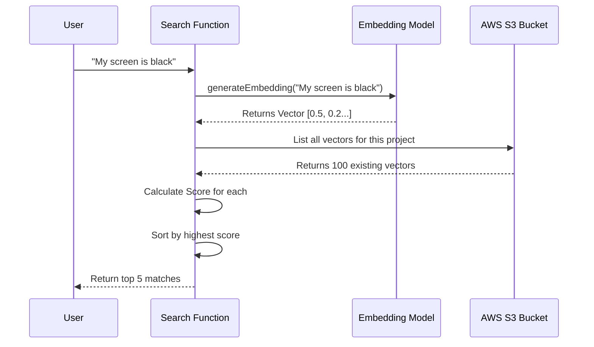

# Chapter 4: Vector Search System

In the previous chapter, [AI Knowledge Processor](03_ai_knowledge_processor_.md), we built a "Brain" that extracts useful "How-To" guides from messy documents. We mentioned a magic step where the processor checks if a topic already exists to avoid duplicates.

But how does the computer know that *"How to fix login"* is the same topic as *"Troubleshooting authentication"*? They don't share a single word!

In this chapter, we will build the **Vector Search System**.

## The Problem: Keywords are Dumb

Traditional search engines look for exact word matches.
*   **Query:** "Big red apple"
*   **Document:** "Large crimson fruit"
*   **Result:** No match. (Because "Big" != "Large").

This is bad for a smart assistant. Users speak naturally; they don't use specific database keywords.

**The Solution:** **Vector Embeddings**.

We need a system that translates **Text** into **Numbers** (coordinates) based on *meaning*.
*   "Big" and "Large" will have similar numbers.
*   "Apple" and "Car" will have very different numbers.

### The Use Case

We will solve this specific scenario:
> 1. We have a database of technical guides.
> 2. A user asks: "My screen is black."
> 3. Our system finds the guide titled "Display troubleshooting" because the *meaning* is close.

---

## Concept 1: Embeddings (The Translator)

An **Embedding** is just a list of numbers (a vector). You can think of it like coordinates on a map.

Imagine a map of "Concepts":
*   "Cat" and "Dog" are close together in the "Animal" city.
*   "Car" and "Truck" are close together in the "Vehicle" city.
*   "Cat" is very far away from "Truck".

We use an AI model (specifically an **Embedding Model**) to turn text into these coordinates.

```javascript
// src/lib/embeddings.js (Simplified)
import { embed } from 'ai';
import { bedrock } from '@ai-sdk/amazon-bedrock';

const EMBED_MODEL = bedrock.textEmbeddingModel('amazon.titan-embed-text-v2:0');

export async function generateEmbedding(text) {
  // Ask the AI model to convert text to numbers
  const { embedding } = await embed({
    model: EMBED_MODEL,
    value: text,
  });

  return embedding; // Returns [0.12, -0.54, 0.88, ...]
}
```
*Explanation:* We give the model text. It gives us back an array of floating-point numbers representing the "location" of that meaning.

---

## Concept 2: The Bookshelf (S3 Storage)

Once we turn a document into a list of numbers, we need to save it. Since these are just JSON lists, we can store them as simple files in AWS S3.

We organize them by Project ID so we don't mix up different users' data.

```javascript
// src/lib/embeddings.js
import { S3Client, PutObjectCommand } from '@aws-sdk/client-s3';
const s3 = new S3Client({});

export async function putVector(projectId, topicId, data) {
  // Save the vector to a file path like: vectors/project-1/topic-5.json
  await s3.send(new PutObjectCommand({
    Bucket: process.env.VECTOR_BUCKET,
    Key: `vectors/${projectId}/${topicId}.json`,
    Body: JSON.stringify(data), // Save the numbers + metadata
  }));
}
```
*Explanation:* We act like a librarian placing a card in a catalog. The `Key` is the shelf location.

---

## Concept 3: Similarity (The Ruler)

Now for the magic. How do we search?
We use a math formula called **Cosine Similarity**. It measures the angle between two vectors.

*   **Score 1.0:** Identical meaning.
*   **Score 0.0:** Completely unrelated.

To search, we:
1.  Convert the User's Question into numbers.
2.  Compare those numbers with *every* document in our S3 bucket.
3.  Return the ones with the highest scores.

---

## Under the Hood: The Search Flow

Let's visualize what happens when a user runs a search.



### Implementing the Search

Let's look at `src/lib/embeddings.js` to see how we implement this logic.

**Step 1: Load the Data**
First, we need a helper to pull all the vectors from S3.

```javascript
// src/lib/embeddings.js (Helper)
async function loadAllVectors(projectId) {
  // 1. Get list of files in the project folder
  const { Contents } = await s3.send(new ListObjectsV2Command({
    Bucket: BUCKET,
    Prefix: `vectors/${projectId}/`,
  }));

  // 2. Download and parse each file
  // (In a real production app, we would use a Vector Database like Pinecone, 
  // but for simple apps, S3 works fine!)
  const results = await Promise.all(
    Contents.map(({ Key }) => getVector(Key))
  );
  return results;
}
```

**Step 2: The Search Function**
Now we combine the Embedding generation and the Math.

```javascript
// src/lib/embeddings.js
import { cosineSimilarity } from 'ai';

export async function searchSimilar(projectId, queryText, topK = 5) {
  // 1. Convert the USER'S query into numbers
  const { embedding: queryEmbedding } = await embed({
    model: EMBED_MODEL,
    value: queryText,
  });

  // 2. Get all our stored documents
  const allVectors = await loadAllVectors(projectId);

  // 3. Score them!
  const scored = allVectors.map(v => ({
    ...v,
    score: cosineSimilarity(queryEmbedding, v.embedding),
  }));

  // 4. Sort: Highest score first. Return top K results.
  scored.sort((a, b) => b.score - a.score);
  return scored.slice(0, topK);
}
```

*Explanation:*
1.  **Embed:** Turn the question into numbers.
2.  **Load:** Fetch the library.
3.  **Map:** Attach a "score" to every document using `cosineSimilarity`.
4.  **Sort:** Put the best matches at the top.

---

## Connecting it to the Admin API

We want to test this easily. In `src/admin/routes/search.js`, we expose this functionality via a simple web request.

```javascript
// src/admin/routes/search.js
import { searchSimilar } from '../../lib/embeddings.js';

export async function search({ params, query }) {
  const [projectId] = params;
  
  // Run the logic we just wrote
  const results = await searchSimilar(projectId, query.q, 5);

  return { 
    statusCode: 200, 
    body: { results } 
  };
}
```

Now, if we visit `GET /admin/projects/123/search?q=screen+broken`, we get back a JSON list of relevant documents, even if they don't say "broken."

---

## Summary

In this chapter, we gave our application the ability to understand **Meaning**, not just keywords.

1.  **Embedding:** We used an AI model to turn text into coordinate lists.
2.  **Storage:** We stored these lists in S3 files.
3.  **Search:** We compared the user's question coordinates with our file coordinates to find the closest matches.

**One missing piece:**
We've been talking about "storing documents" and "Project IDs," but we haven't actually built the database that holds the *text* content (the title, the body, the author). We've only stored the *vectors* (the numbers).

We need a fast, reliable database to store the actual content.

In the next chapter, we will build the **Single-Table Data Access** layer using DynamoDB.

[Next Chapter: Single-Table Data Access](05_single_table_data_access_.md)

---

Generated by [AI Codebase Knowledge Builder](https://github.com/The-Pocket/Tutorial-Codebase-Knowledge)