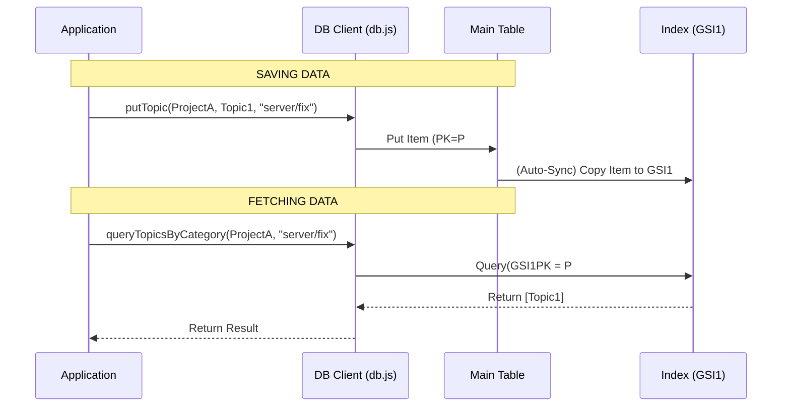

# Chapter 5: Single-Table Data Access

In the previous chapter, [Vector Search System](04_vector_search_system_.md), we learned how to turn text into numbers (vectors) so we can search by *meaning*. We stored those numbers in simple files on S3.

However, an application needs more than just search. We need to store **Projects**, **Documents**, and **Topics** reliably. We need to be able to say, "Show me all topics in Project A" or "Update the title of Document B."

In this chapter, we will build the storage foundation using **DynamoDB**.

## The Problem: The "Join" Headache

Imagine you are organizing a physical office.
*   **SQL Approach:** You have one filing cabinet for "Projects," a separate cabinet across the room for "Documents," and a third one for "Topics." To gather a full report, you have to run between three cabinets.
*   **The Issue:** As your data grows, this running around (called "Joining" tables) gets slow.

**The Solution:** **Single-Table Design**.

We are going to put **everything**—Projects, Documents, and Topics—into **one giant, highly organized filing cabinet**.

By using smart labels, we ensure that a Project and all its related Topics sit right next to each other inside the database. This makes fetching them incredibly fast.

### The Use Case

We will solve this specific scenario:
> 1. We want to save a new **Topic** (extracted by our AI).
> 2. Later, we want to fetch **all Topics** belonging to a specific Category (like "server/maintenance").
> 3. We want to do this in a single, fast request.

---

## Concept 1: The Labels (PK and SK)

In DynamoDB, every item needs a unique address. This address is made of two parts:

1.  **Partition Key (PK):** Think of this as the **Hanging Folder**. It groups related items together.
2.  **Sort Key (SK):** Think of this as the **Specific Paper** inside that folder. It identifies the unique item.

Let's see how we label our data to keep it organized:

| Item Type | PK (The Folder) | SK (The Paper) |
| :--- | :--- | :--- |
| **Project** | `PROJECT` | `PROJECT#123` |
| **Document** | `P#123#DOC` | `DOC#abc` |
| **Topic** | `P#123#TOPIC` | `TOPIC#xyz` |

*   **Notice:** The Project ID (`123`) is baked right into the keys.
*   **The Benefit:** If we want all documents for Project 123, we just open the folder labeled `P#123#DOC` and grab everything inside.

---

## Concept 2: Saving Data

Let's look at `src/lib/db.js`. This file handles all our talking to the database.

### Saving a Project

First, we need a function to create a project.

```javascript
// src/lib/db.js
export async function putProject(project) {
  const item = {
    PK: 'PROJECT',            // The Folder
    SK: `PROJECT#${project.id}`, // The specific ID
    id: project.id,
    name: project.name,
    createdAt: new Date().toISOString(),
  };
  
  // Send to DynamoDB
  await ddb.send(new PutCommand({ TableName: TABLE, Item: item }));
}
```
*Explanation:* We create a JavaScript object with our special `PK` and `SK` labels, plus the actual data (`name`, `id`), and send it to AWS.

### Saving a Topic

Now, let's save a Topic. This is what the [AI Knowledge Processor](03_ai_knowledge_processor_.md) calls after it extracts information.

```javascript
// src/lib/db.js
export async function putTopic(projectId, topic) {
  await ddb.send(new PutCommand({
    TableName: TABLE,
    Item: {
      PK: `P#${projectId}#TOPIC`, // Group by Project
      SK: `TOPIC#${topic.id}`,    // Unique ID
      category: topic.category,
      title: topic.title,
      summary: topic.summary,
      // ... other fields
    },
  }));
}
```
*Explanation:* We use the `projectId` to ensure this topic lands in the correct "folder" (`P#...#TOPIC`).

---

## Concept 3: The Cross-Reference (GSI)

We have a problem. We stored topics by **ID** (`TOPIC#xyz`).
But our use case is: *"Fetch all topics in the 'server/maintenance' category."*

If we look in the folder `P#123#TOPIC`, we see a list of IDs. We don't see categories. We would have to read every single paper to find the right ones.

**The Solution:** A **Global Secondary Index (GSI)**.

Think of a GSI as a **Photocopy** of your data, filed in a *different* order.
*   **Main Table:** Filed by ID.
*   **GSI1 (The Copy):** Filed by Category.

We add these special "GSI labels" when we save the item:

```javascript
// src/lib/db.js (Inside putTopic)
    Item: {
      // ... PK and SK ...
      
      // The "Photocopy" labels:
      GSI1PK: `P#${projectId}#CAT#${topic.category}`,
      GSI1SK: `TOPIC#${topic.id}`,
    },
```

Now, AWS automatically maintains a second list for us, grouped by Category!

---

## Concept 4: Fetching Data

Now we can write the function to solve our use case.

```javascript
// src/lib/db.js
export async function queryTopicsByCategory(projectId, category) {
  const { Items } = await ddb.send(new QueryCommand({
    TableName: TABLE,
    IndexName: 'GSI1', // Tell AWS to look at the "Photocopy"
    
    // "Open the folder labeled with this Project + Category"
    KeyConditionExpression: 'GSI1PK = :pk',
    ExpressionAttributeValues: { 
      ':pk': `P#${projectId}#CAT#${category}` 
    },
  }));
  
  return Items;
}
```

*Explanation:*
1.  We specify `IndexName: 'GSI1'`.
2.  We ask for the specific folder: `P#123#CAT#server/maintenance`.
3.  DynamoDB instantly returns all topics in that category.

---

## Under the Hood: The Data Flow

Let's visualize what happens when we save and then query a topic.



### Advanced: Atomic Transactions

Sometimes we need to do two things at once, or do nothing at all.
For example, when the AI decides to **Replace** an old topic with a new one, we don't want to accidentally delete the old one if saving the new one fails.

We use `TransactWriteCommand`.

```javascript
// src/lib/db.js
export async function replaceTopic(projectId, topicId, replacementId) {
  await ddb.send(new TransactWriteCommand({
    TransactItems: [
      {
        // 1. Delete the old topic
        Delete: {
          TableName: TABLE,
          Key: { PK: `P#${projectId}#TOPIC`, SK: `TOPIC#${topicId}` },
        },
      },
      {
        // 2. Save the new "Replaced" record (for history)
        Put: {
          TableName: TABLE,
          Item: { /* ... data ... */ },
        },
      },
    ],
  }));
}
```
*Explanation:* This acts like a contract. AWS guarantees that either **both** actions happen, or **neither** happens. This prevents data corruption.

---

## Summary

In this chapter, we built the filing system for our application.

1.  **Single-Table Design:** We put Projects, Docs, and Topics in one table to keep related data close.
2.  **PK/SK:** We used structured text keys (like `P#123#TOPIC`) to organize our folders.
3.  **GSI:** We used a secondary index to allow searching by Category, not just ID.

Now we have a complete system!
1.  **Protocol:** Receives requests (Chapter 1).
2.  **Registry:** Knows what tools exist (Chapter 2).
3.  **Processor:** Thinks and extracts data (Chapter 3).
4.  **Vectors:** Understands meaning (Chapter 4).
5.  **Database:** Remembers everything (Chapter 5).

**The Missing Link:**
Right now, to add data, a human has to manually upload a file. Real-world systems need to work in the background, automatically scraping websites and processing data without making the user wait.

In the next chapter, we will build the **Asynchronous Ingestion Pipeline**.

[Next Chapter: Asynchronous Ingestion Pipeline](06_asynchronous_ingestion_pipeline_.md)

---

Generated by [AI Codebase Knowledge Builder](https://github.com/The-Pocket/Tutorial-Codebase-Knowledge)