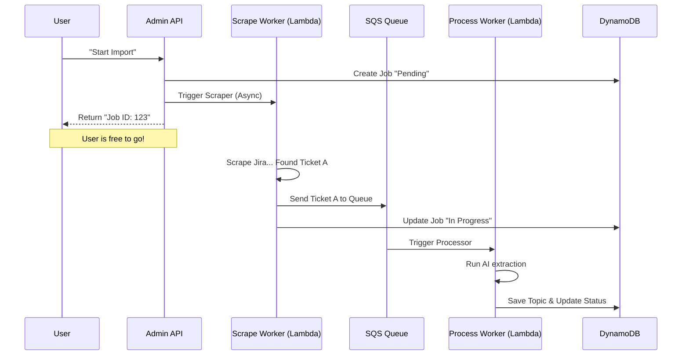

# Chapter 6: Asynchronous Ingestion Pipeline

In the previous chapter, [Single-Table Data Access](05_single_table_data_access_.md), we built a robust filing cabinet (DynamoDB) to store our data.

However, right now, our system has a major limitation: **It's manual.** To get data in, we have to upload files one by one. If we want to import 5,000 tickets from Jira, we can't just make the user wait while the browser freezes for an hour.

In this chapter, we will build the **Asynchronous Ingestion Pipeline**.

## The Problem: The "Spinning Wheel"

Imagine you go to a coffee shop.
*   **Synchronous (Bad):** You order a latte. The cashier stops talking to everyone, walks to the machine, steams the milk, pours the shot, hands it to you, and *only then* takes the next customer's order. The line goes out the door.
*   **Asynchronous (Good):** You order a latte. The cashier hands you a **Ticket Number** and takes the next order immediately. A barista (a background worker) makes the coffee. When it's done, they call your number.

**The Solution:** We need a system where the user clicks "Import," gets a "Job ID," and the server does the heavy lifting in the background.

### The Use Case

We will solve this specific scenario:
> 1. A user asks to "Import Project X from Jira."
> 2. The system immediately replies: "Okay, started Job #123."
> 3. In the background, a worker scrapes 500 tickets.
> 4. Another worker processes them with AI and saves them to the database.

---

## Concept 1: The Scraper (The Gatherer)

First, we need code that can go out to the internet (Jira or Confluence) and fetch data. We use a programming concept called **Generators**.

Think of a Generator as a water tap. Instead of dumping a bucket of 5,000 items on us at once (crashing the server), it gives us one item at a time.

```javascript
// src/lib/scraper.js (Simplified)
export async function* scrapeJira({ baseUrl, jql }) {
  // 1. Fetch a page of tickets from Jira API
  const tickets = await getJiraTickets(baseUrl, jql);

  // 2. "Yield" them one by one
  for (const ticket of tickets) {
    yield {
      url: ticket.url,
      title: ticket.key + ": " + ticket.summary,
      contents: ticket.description
    };
  }
  // The loop continues to the next page automatically...
}
```
*Explanation:* The `async function*` and `yield` keywords allow this function to pause and resume, handling massive datasets without running out of memory.

---

## Concept 2: The Queue (DynamoDB + Lambda Invoke)

Once we scrape a ticket, we don't process it immediately. AI processing takes time (seconds per document). If we scrape fast but process slow, we create a bottleneck.

We use **DynamoDB** as the job queue and **direct Lambda invocation** for worker coordination.
1.  **Scraper Worker:** Creates process job records in DynamoDB with status `pending`, then invokes the Process Worker Lambda asynchronously.
2.  **Process Worker:** Claims pending jobs (conditional update to `processing`), runs the AI, and marks them `completed` or `failed`.

This ensures that if the AI is slow, the scraper doesn't have to stop working.

---

## Concept 3: Job Tracking (The Status Board)

Since the user isn't watching a loading bar, we need to save the status in our database so they can check it later.

We use our DynamoDB setup from Chapter 5.

```javascript
// src/lib/queue.js
export async function putScrapeJob(projectId, job) {
  await ddb.send(new PutCommand({
    TableName: TABLE,
    Item: {
      PK: `P#${projectId}#SCRAPE`, // Group by Project
      SK: `JOB#${job.id}`,         // Unique Job ID
      status: 'pending',           // pending, scraping, completed
      docsFound: 0,
    },
  }));
}
```
*Explanation:* This creates a record like "Job 123 is currently Pending." We update this record as the workers finish their tasks.

---

## Under the Hood: The Relay Race

Let's visualize the flow of data through our factory.



---

## Implementation Step 1: The Scrape Worker

This worker is the "Foreman." It starts the job, fetches the raw data, and creates process jobs.

It lives in `src/workers/scrapeWorker.js`.

```javascript
// src/workers/scrapeWorker.js
import { scrapeJira } from '../lib/scraper.js';
import { LambdaClient, InvokeCommand } from '@aws-sdk/client-lambda';

export const handler = async (event) => {
  const { projectId, jobId, config } = event;

  // 1. Start the generator
  const scraper = scrapeJira(config);

  for await (const doc of scraper) {
    // 2. Save raw doc to DB
    const docId = await saveRawDocToDB(projectId, doc);

    // 3. Create a process job in DynamoDB (status: pending)
    await putProcessJob(projectId, { id: ulid(), docId, status: 'pending' });
  }

  // 4. Invoke the Process Worker Lambda asynchronously
  await lambda.send(new InvokeCommand({
    FunctionName: process.env.PROCESS_WORKER_FN,
    InvocationType: 'Event',
    Payload: JSON.stringify({ projectId }),
  }));
};
```
*Explanation:*
1.  It wakes up when we tell it to start a job.
2.  It loops through every ticket found in Jira.
3.  It creates pending process jobs in DynamoDB, then triggers the Process Worker Lambda.

---

## Implementation Step 2: The Process Worker

This worker is the "Specialist." It claims pending jobs from DynamoDB and processes them.

It lives in `src/workers/processWorker.js`.

```javascript
// src/workers/processWorker.js
import { processDocument } from '../lib/processor.js';

export const handler = async (event) => {
  const { projectId } = event;

  // 1. List pending jobs and claim them (conditional update)
  const jobs = await listAndClaimJobs(projectId, concurrency);

  // 2. Process each claimed job in parallel
  await Promise.all(jobs.map(async (job) => {
    const doc = await getDoc(projectId, job.docId);
    
    // 3. Run the AI Brain + BM25 indexing (From Chapter 3)
    await processDocument(projectId, {
      url: doc.url,
      contents: doc.contents
    });
    
    await updateProcessJob(projectId, job.id, { status: 'completed' });
  }));

  // 4. If more pending jobs exist, re-invoke self
  if (morePending) {
    await lambda.send(new InvokeCommand({ ... }));
  }
};
```
*Explanation:*
1.  The worker claims jobs using a DynamoDB conditional update (only if `status === 'pending'`), preventing duplicate processing.
2.  It reuses the logic we wrote in [AI Knowledge Processor](03_ai_knowledge_processor_.md), which now also updates the BM25 index.
3.  With `ReservedConcurrentExecutions: 2`, up to 2 workers run in parallel. Each processes multiple jobs concurrently.

---

## Handling Updates

In `src/lib/queue.js`, we have helper functions to keep the scoreboard updated.

```javascript
// src/lib/queue.js
export async function updateScrapeJob(projectId, jobId, updates) {
  // Update DynamoDB with new counts
  await ddb.send(new UpdateCommand({
    TableName: TABLE,
    Key: { PK: `P#${projectId}#SCRAPE`, SK: `JOB#${jobId}` },
    UpdateExpression: `SET status = :s, docsFound = :d`,
    ExpressionAttributeValues: {
      ':s': updates.status,
      ':d': updates.docsFound
    },
  }));
}
```
*Explanation:* The workers call this periodically. Even though the user isn't watching, the database knows exactly how many documents have been finished.

---

## Summary

In this chapter, we turned our single-player application into a factory.

1.  **Generators:** We used `yield` to handle large streams of data from Jira/Confluence.
2.  **Job Queue:** We used DynamoDB to track job status and direct Lambda invocation for worker coordination.
3.  **Workers:** We built background Lambda functions with concurrency control and self-reinvocation for long-running batches.

Now our system is powerful, smart, and scalable. But currently, the only way to trigger these jobs is by manually invoking code. We need a control panel.

In the final chapter, we will build the **Admin REST API** to let the outside world (and our frontend) control this machinery.

[Next Chapter: Admin REST API](07_admin_rest_api_.md)

---

Generated by [AI Codebase Knowledge Builder](https://github.com/The-Pocket/Tutorial-Codebase-Knowledge)