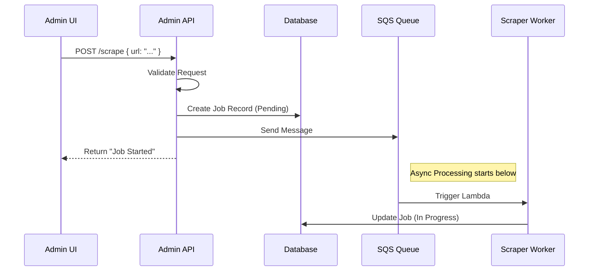

# Chapter 7: Admin REST API

In the previous chapter, [Asynchronous Ingestion Pipeline](06_asynchronous_ingestion_pipeline_.md), we built a powerful factory that can scrape thousands of documents in the background.

However, right now, our system is a bit like a car engine without a dashboard. It's running, but we can't see the speedometer, we don't know the fuel level, and we can't turn the key to stop it.

In this final chapter, we will build the **Admin REST API**.

## The Problem: Robots vs. Humans

Throughout this course, we've focused on the **MCP Protocol**.
*   **Target Audience:** AI Agents (Claude, Cursor).
*   **Language:** JSON-RPC.

But you, the human developer, need a way to manage this system. You need a web dashboard (built in React or Vue) to create projects, view logs, and fix stuck jobs. Your web browser doesn't speak JSON-RPC natively; it prefers **REST**.

**The Solution:** The **Admin REST API**.

This is a separate entry point to our server. While the MCP layer serves the AI, this layer serves the human UI.

### The Use Case

We will solve this specific scenario:
> 1. A System Administrator logs into the dashboard.
> 2. They see that "Job #123" is stuck.
> 3. They click a "Retry" button.
> 4. The server resets the job and puts it back in the queue.

---

## Concept 1: The HTTP Router

Just like we had a router for MCP in Chapter 1, we need a router for standard Web Requests. It needs to look at the **URL** (e.g., `/projects/123`) and the **Method** (e.g., `GET` or `POST`).

We define our routes in a simple list in `src/admin/router.js`.

```javascript
// src/admin/router.js
const routes = [
  // GET: Read data
  { method: 'GET',  pattern: /^\/projects$/, handler: projectRoutes.list },
  
  // POST: Change data (Trigger an action)
  { method: 'POST', pattern: /^\/projects\/([^/]+)\/scrape$/, handler: scrapeRoutes.enqueue },
  
  // ... more routes ...
];
```

*Explanation:* We use Regular Expressions (Regex) to match URLs. If a user visits `/projects/5/scrape`, the `([^/]+)` part captures the ID "5".

### The Dispatcher

We need a small function to find the matching route.

```javascript
// src/admin/router.js
export async function route(method, path, body, query) {
  for (const r of routes) {
    // 1. Check if Method matches (GET vs POST)
    if (r.method !== method) continue;
    
    // 2. Check if URL matches
    const match = path.match(r.pattern);
    if (match) {
      // 3. Extract IDs (like project ID) and run the handler
      const params = match.slice(1).map(decodeURIComponent);
      return r.handler({ params, body, query });
    }
  }
  return { statusCode: 404, body: { error: 'Not found' } };
}
```

---

## Concept 2: Viewing Status (GET)

Let's implement the logic to see what's happening in our factory. This corresponds to the "Speedometer" on our dashboard.

We want to see how many documents have been scraped.

```javascript
// src/admin/routes/queues.js
export async function status({ params }) {
  const [projectId] = params;

  // Fetch counts from our Database (Chapter 5)
  const counts = await getQueueCounts(projectId);
  
  // Fetch active jobs (Chapter 6)
  const jobs = await listScrapeJobs(projectId);

  return {
    statusCode: 200,
    body: {
      stats: counts,
      activeJobs: jobs
    },
  };
}
```
*Explanation:* When the frontend requests `GET /projects/1/queues`, we query DynamoDB and return a JSON summary.

---

## Concept 3: Controlling the Machine (POST)

Now for the "Buttons." What happens when the admin clicks "Start Import"?

We need to trigger the logic we built in [Asynchronous Ingestion Pipeline](06_asynchronous_ingestion_pipeline_.md).

```javascript
// src/admin/routes/scrape.js
import { putScrapeJob } from '../../lib/queue.js';

export async function enqueue({ params, body }) {
  const [projectId] = params;
  const { config } = body; // e.g., URL to scrape

  // 1. Create a Job ID
  const jobId = ulid();

  // 2. Save "Pending" status to DB
  await putScrapeJob(projectId, { id: jobId, status: 'pending' });

  // 3. Send message to SQS to wake up the worker
  await sendToSQS(SCRAPE_QUEUE_URL, { projectId, jobId, config });

  return { statusCode: 202, body: { jobId, status: 'pending' } };
}
```
*Explanation:*
1.  **Validate:** We check the input.
2.  **Record:** We note in the database that a job exists.
3.  **Trigger:** We send a message to the Queue.
4.  **Respond:** We tell the UI "Accepted" (HTTP 202).

---

## Under the Hood: The Control Flow

Let's visualize exactly what happens when you click that button on the dashboard.



---

## Advanced: The "Panic Button"

Sometimes, things go wrong. Maybe the AI API was down, and 50 jobs failed. We need a way to **Retry** them.

The UI provides two recovery buttons:
*   **Requeue Stuck** — for jobs stuck in `processing` (worker crashed or timed out).
*   **Retry Failed** — for jobs that errored out during processing.

```javascript
// src/admin/routes/queues.js
export async function requeue({ params, body }) {
  const [projectId] = params;
  const { jobIds, status } = body; // Either specific IDs or a status filter

  let ids = jobIds || [];
  if (ids.length === 0 && status) {
    ids = await listProcessJobIdsByStatus(projectId, status);
  }

  for (const jobId of ids) {
    await updateProcessJob(projectId, jobId, { status: 'pending', error: null });
  }

  // Invoke the process worker to pick up the requeued jobs
  if (ids.length > 0) {
    await invokeWorker(PROCESS_WORKER_FN, { projectId });
  }

  return { statusCode: 200, body: { requeued: ids.length } };
}
```
*Explanation:* We reset the job status to `pending`, clear any error message, and invoke the Process Worker Lambda to pick them up.

---

## BM25 Search Endpoints

The Admin API also exposes BM25 keyword search management:

*   `GET /projects/:id/bm25?q=...` — Search documents by keywords.
*   `GET /projects/:id/bm25/stats` — Index stats (document count, total words, compressed size).
*   `POST /projects/:id/bm25/reindex` — Rebuild the entire BM25 index from all documents (one S3 write).

The BM25 index is stored as a gzip-compressed JSON file in S3. The reindex endpoint loads all documents from DynamoDB in pages, builds the index in memory, and writes it in a single S3 operation.

## Authentication

The Admin API is protected by **HTTP Basic Auth**. Credentials are stored in AWS Secrets Manager and cached by the Lambda on cold start.

```javascript
// src/admin/auth.js (simplified)
export async function checkAuth(event) {
  const header = event.headers?.authorization || '';
  if (!header.startsWith('Basic ')) return false;

  const [user, pass] = atob(header.slice(6)).split(':');
  const creds = await getCredentials(); // Cached from Secrets Manager
  return user === creds.username && pass === creds.password;
}
```

The UI stores credentials in localStorage and sends the `Authorization` header with every request. If a 401 is returned, the login form is shown.

---

## Project Conclusion

Congratulations! You have reached the end of the `memory-mcp` tutorial series. You have built a complete, production-ready AI memory system.

Let's recap what we built:

1.  **[MCP Protocol Layer](01_mcp_protocol_layer_.md):** The "Front Door" that lets AI agents talk to our code via JSON-RPC.
2.  **[Tool Registry](02_tool_registry_.md):** Three tools: `semantic_search`, `bm25_search`, and `get_document`.
3.  **[AI Knowledge Processor](03_ai_knowledge_processor_.md):** The "Brain" that breaks documents into chunks, generates embeddings, and updates the BM25 index.
4.  **[Vector Search System](04_vector_search_system_.md):** Semantic similarity via S3 Vectors, plus BM25 keyword search via a gzip-compressed JSON index in S3.
5.  **[Single-Table Data Access](05_single_table_data_access_.md):** The "Filing Cabinet" using DynamoDB single-table design.
6.  **[Asynchronous Ingestion Pipeline](06_asynchronous_ingestion_pipeline_.md):** The "Factory" using Lambda workers with DynamoDB job tracking and direct invocation.
7.  **[Admin REST API](07_admin_rest_api_.md):** The "Control Panel" with Basic Auth, BM25 management, and job retry capabilities.

You now have a system where an AI can say *"Search the documentation for Project X"*, using either semantic or keyword search, and your server will return ranked documents with summaries. The full pipeline—scraping, chunking, embedding, indexing—runs in the background with full visibility via the admin dashboard.

---

Generated by [AI Codebase Knowledge Builder](https://github.com/The-Pocket/Tutorial-Codebase-Knowledge)