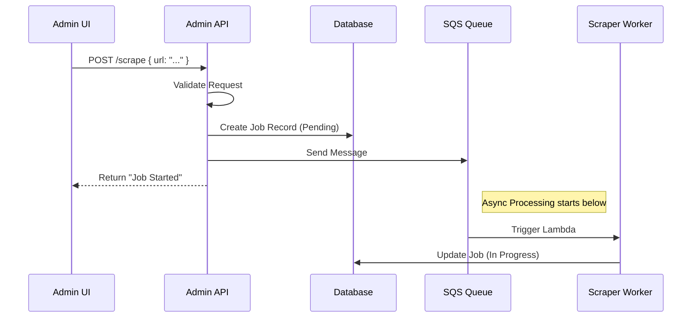

# Chapter 7: Admin REST API

In the previous chapter, [Asynchronous Ingestion Pipeline](06_asynchronous_ingestion_pipeline_.md), we built a powerful factory that can scrape thousands of documents in the background.

However, right now, our system is a bit like a car engine without a dashboard. It's running, but we can't see the speedometer, we don't know the fuel level, and we can't turn the key to stop it.

In this final chapter, we will build the **Admin REST API**.

## The Problem: Robots vs. Humans

Throughout this course, we've focused on the **MCP Protocol**.
*   **Target Audience:** AI Agents (Claude, Cursor).
*   **Language:** JSON-RPC.

But you, the human developer, need a way to manage this system. You need a web dashboard (built in React or Vue) to create projects, view logs, and fix stuck jobs. Your web browser doesn't speak JSON-RPC natively; it prefers **REST**.

**The Solution:** The **Admin REST API**.

This is a separate entry point to our server. While the MCP layer serves the AI, this layer serves the human UI.

### The Use Case

We will solve this specific scenario:
> 1. A System Administrator logs into the dashboard.
> 2. They see that "Job #123" is stuck.
> 3. They click a "Retry" button.
> 4. The server resets the job and puts it back in the queue.

---

## Concept 1: The HTTP Router

Just like we had a router for MCP in Chapter 1, we need a router for standard Web Requests. It needs to look at the **URL** (e.g., `/projects/123`) and the **Method** (e.g., `GET` or `POST`).

We define our routes in a simple list in `src/admin/router.js`.

```javascript
// src/admin/router.js
const routes = [
  // GET: Read data
  { method: 'GET',  pattern: /^\/projects$/, handler: projectRoutes.list },
  
  // POST: Change data (Trigger an action)
  { method: 'POST', pattern: /^\/projects\/([^/]+)\/scrape$/, handler: scrapeRoutes.enqueue },
  
  // ... more routes ...
];
```

*Explanation:* We use Regular Expressions (Regex) to match URLs. If a user visits `/projects/5/scrape`, the `([^/]+)` part captures the ID "5".

### The Dispatcher

We need a small function to find the matching route.

```javascript
// src/admin/router.js
export async function route(method, path, body, query) {
  for (const r of routes) {
    // 1. Check if Method matches (GET vs POST)
    if (r.method !== method) continue;
    
    // 2. Check if URL matches
    const match = path.match(r.pattern);
    if (match) {
      // 3. Extract IDs (like project ID) and run the handler
      const params = match.slice(1).map(decodeURIComponent);
      return r.handler({ params, body, query });
    }
  }
  return { statusCode: 404, body: { error: 'Not found' } };
}
```

---

## Concept 2: Viewing Status (GET)

Let's implement the logic to see what's happening in our factory. This corresponds to the "Speedometer" on our dashboard.

We want to see how many documents have been scraped.

```javascript
// src/admin/routes/queues.js
export async function status({ params }) {
  const [projectId] = params;

  // Fetch counts from our Database (Chapter 5)
  const counts = await getQueueCounts(projectId);
  
  // Fetch active jobs (Chapter 6)
  const jobs = await listScrapeJobs(projectId);

  return {
    statusCode: 200,
    body: {
      stats: counts,
      activeJobs: jobs
    },
  };
}
```
*Explanation:* When the frontend requests `GET /projects/1/queues`, we query DynamoDB and return a JSON summary.

---

## Concept 3: Controlling the Machine (POST)

Now for the "Buttons." What happens when the admin clicks "Start Import"?

We need to trigger the logic we built in [Asynchronous Ingestion Pipeline](06_asynchronous_ingestion_pipeline_.md).

```javascript
// src/admin/routes/scrape.js
import { putScrapeJob } from '../../lib/queue.js';

export async function enqueue({ params, body }) {
  const [projectId] = params;
  const { config } = body; // e.g., URL to scrape

  // 1. Create a Job ID
  const jobId = ulid();

  // 2. Save "Pending" status to DB
  await putScrapeJob(projectId, { id: jobId, status: 'pending' });

  // 3. Send message to SQS to wake up the worker
  await sendToSQS(SCRAPE_QUEUE_URL, { projectId, jobId, config });

  return { statusCode: 202, body: { jobId, status: 'pending' } };
}
```
*Explanation:*
1.  **Validate:** We check the input.
2.  **Record:** We note in the database that a job exists.
3.  **Trigger:** We send a message to the Queue.
4.  **Respond:** We tell the UI "Accepted" (HTTP 202).

---

## Under the Hood: The Control Flow

Let's visualize exactly what happens when you click that button on the dashboard.



---

## Advanced: The "Panic Button"

Sometimes, things go wrong. Maybe the AI API was down, and 50 jobs failed. We need a way to **Retry** them.

This logic lives in `src/admin/routes/queues.js`.

```javascript
// src/admin/routes/queues.js
export async function requeue({ params, body }) {
  const [projectId] = params;
  const { jobIds } = body; // List of failed IDs

  for (const jobId of jobIds) {
    // 1. Reset status in DB to "Pending"
    await updateProcessJob(projectId, jobId, { status: 'pending' });

    // 2. Put it back on the conveyor belt (Queue)
    await sqs.send(new SendMessageCommand({
      QueueUrl: PROCESS_QUEUE_URL,
      MessageBody: JSON.stringify({ projectId, jobId }),
    }));
  }

  return { statusCode: 200, body: { message: 'Jobs requeued' } };
}
```
*Explanation:* We don't need to re-scrape the data. We just tell the database "Try again" and put the existing document ID back into the processing queue.

---

## Controlling Concurrency

Another cool feature for admins is controlling how fast the system runs. If the database is getting overwhelmed, we might want to slow down the workers.

We can control AWS Lambda settings directly from our API!

```javascript
// src/admin/routes/queues.js
export async function control({ body }) {
  const { action, value } = body; // e.g. action="concurrency", value=5

  if (action === 'concurrency') {
    // Tell AWS: Only run 5 workers at a time
    await lambda.send(new UpdateEventSourceMappingCommand({
      UUID: MAPPING_UUID,
      ScalingConfig: { MaximumConcurrency: parseInt(value) },
    }));
  }

  return { statusCode: 200, body: { success: true } };
}
```
*Explanation:* This effectively acts as a "Throttle" lever on our dashboard.

---

## Project Conclusion

Congratulations! You have reached the end of the `memory-mcp` tutorial series. You have built a complete, production-ready AI memory system.

Let's recap what we built:

1.  **[MCP Protocol Layer](01_mcp_protocol_layer_.md):** The "Front Door" that lets AI agents talk to our code.
2.  **[Tool Registry](02_tool_registry_.md):** The "Menu" of capabilities (add_memory, search).
3.  **[AI Knowledge Processor](03_ai_knowledge_processor_.md):** The "Brain" that cleans and organizes raw text.
4.  **[Vector Search System](04_vector_search_system_.md):** The "Translator" that converts text to numbers to find meaning.
5.  **[Single-Table Data Access](05_single_table_data_access_.md):** The "Filing Cabinet" that stores everything efficiently.
6.  **[Asynchronous Ingestion Pipeline](06_asynchronous_ingestion_pipeline_.md):** The "Factory" that handles massive data imports in the background.
7.  **[Admin REST API](07_admin_rest_api_.md):** The "Control Panel" for human administrators.

You now have a system where an AI can say *"Read the documentation for Project X"*, and your server will scrape it, process it, index it, and make it searchable—all while giving you full control via a dashboard.

**Where to go from here?**
*   Build a React frontend to consume the API we just built.
*   Add more tools to the Registry (e.g., "Summarize Project").
*   Deploy the system to AWS using Terraform or CDK.

Thank you for following along!

---

Generated by [AI Codebase Knowledge Builder](https://github.com/The-Pocket/Tutorial-Codebase-Knowledge)