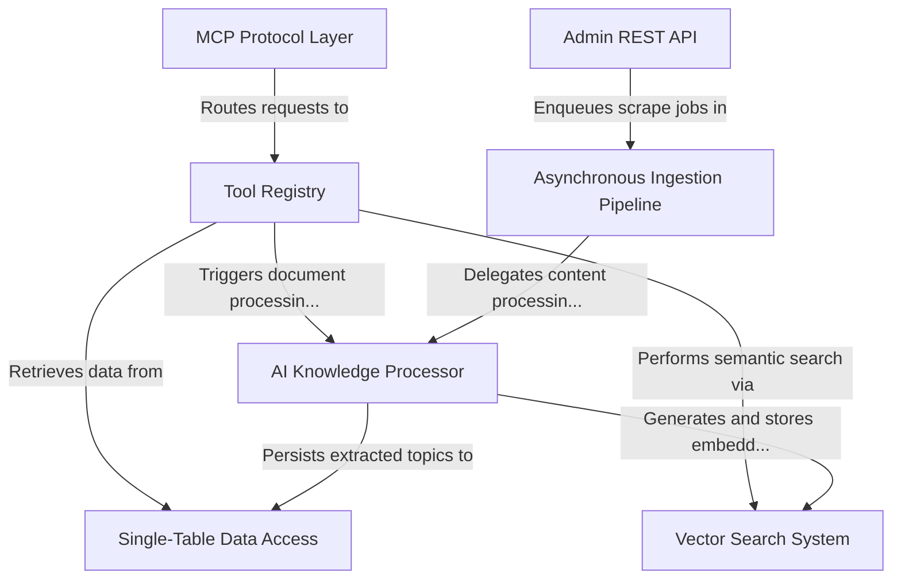

# Tutorial: memory-mcp

This project builds a **Model Context Protocol (MCP)** server that functions as an intelligent *knowledge base* for AI agents. It automates the ingestion of documentation (from sources like Jira and Confluence) via an **Asynchronous Ingestion Pipeline**, uses an **AI Knowledge Processor** to distill raw text into structured "How-To" guides, and enables agents to query this memory using **Vector Search** and standard tools.

**Source Repository:** [None](None)

## Chapters

1. [MCP Protocol Layer
](01_mcp_protocol_layer_.md)
2. [Tool Registry
](02_tool_registry_.md)
3. [AI Knowledge Processor
](03_ai_knowledge_processor_.md)
4. [Vector Search System
](04_vector_search_system_.md)
5. [Single-Table Data Access
](05_single_table_data_access_.md)
6. [Asynchronous Ingestion Pipeline
](06_asynchronous_ingestion_pipeline_.md)
7. [Admin REST API
](07_admin_rest_api_.md)

---

Generated by [AI Codebase Knowledge Builder](https://github.com/The-Pocket/Tutorial-Codebase-Knowledge)